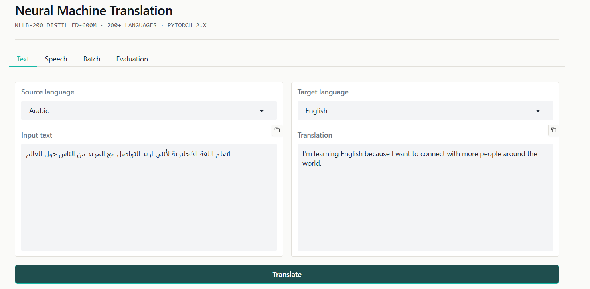
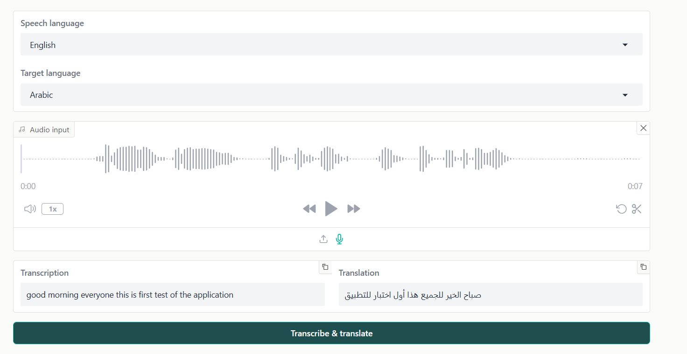
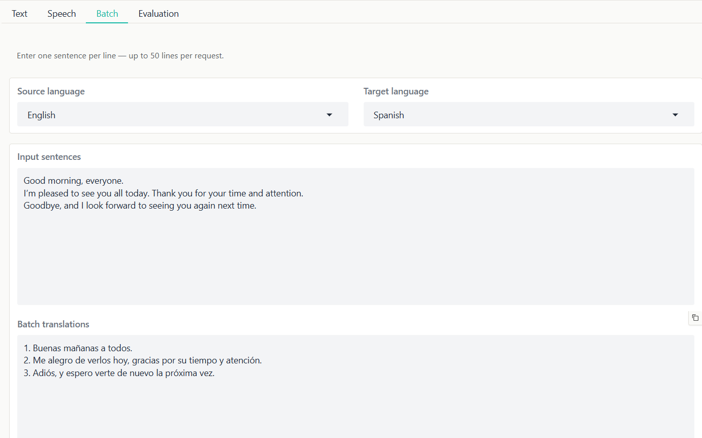
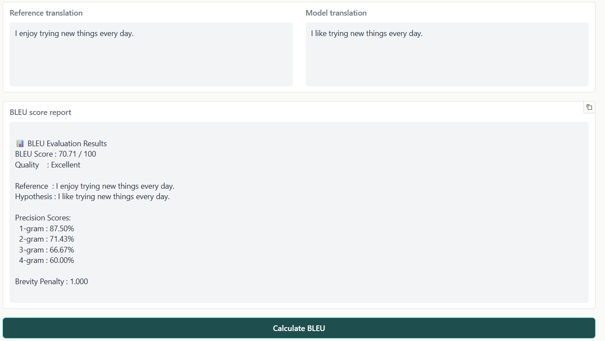

# Neural Machine Translation — AI Translator

A production-style **Neural Machine Translation (NMT)** application built on top of Meta AI's **NLLB-200** (No Language Left Behind) model. The app exposes a clean, interactive web interface for translating text between 200+ languages, transcribing and translating speech, processing translations in bulk, and quantitatively evaluating translation quality with the BLEU metric.

This project is designed to demonstrate practical, end-to-end machine learning engineering: model integration, inference optimization, a tested Python package, CI/CD automation, and a usable product interface — not just a notebook experiment.

---

## Overview

At its core, this application loads `facebook/nllb-200-distilled-600M`, a sequence-to-sequence transformer trained for many-to-many translation across 200 languages, and wraps it in a Gradio UI with four functional surfaces:

- **Single text translation** — translate any sentence or paragraph between two supported languages.
- **Speech-to-text translation** — record or upload audio, transcribe it, and translate the transcription.
- **Batch translation** — translate up to 50 lines of text in a single request.
- **BLEU score evaluation** — score a model translation against a reference translation and get a precision breakdown.

The app runs on CPU or GPU automatically, depending on what hardware is available, and loads the model once at startup so every user-facing translation request is fast and predictable.

---

## Features

- Translation across 200+ languages via NLLB-200's FLORES-200 language codes
- Speech transcription with automatic language-aware recognition
- Batch processing with per-line numbered output
- BLEU scoring with precision breakdown and a brevity penalty report
- Beam search decoding (5 beams, n-gram repeat blocking) for deterministic, high-quality output
- Responsive Gradio interface with a custom editorial-style theme
- Automatic device detection (CUDA if available, otherwise CPU)
- Configuration-driven model and inference settings via `config.yml`
- Unit and integration test suite with mocked and real-model test paths
- Continuous integration and automated deployment to Hugging Face Spaces

---

## NLLB-200 Architecture

NLLB-200 ("No Language Left Behind") is a multilingual machine translation model released by Meta AI, designed to translate directly between any pair of 200+ languages — including many low-resource languages that lack large parallel corpora. This project uses the **distilled 600M-parameter variant**, a smaller, faster model trained to mimic the much larger original NLLB model while remaining practical to run on commodity hardware.

**Sequence-to-sequence transformer.** NLLB-200 follows a standard encoder-decoder transformer design. The encoder reads the source sentence and builds a contextual representation of it; the decoder then generates the target-language sentence one token at a time, attending back to that representation at each step. This is the same general architecture family as models like T5 and mBART, but trained specifically for massively multilingual translation.

**Single shared model, many languages.** Rather than training a separate model for every language pair, NLLB-200 uses one shared encoder and one shared decoder for all 200+ languages. A special source-language token (e.g. `eng_Latn`) is prepended to the input, and the desired target language is selected by forcing the decoder's first generated token to be the corresponding target-language code (e.g. `fra_Latn`). This is the mechanism `forced_bos_token_id` implements in `translate.py` — it tells the decoder which language to generate in before generation begins.

**FLORES-200 language codes.** Languages are identified using FLORES-200 codes in the form `<language>_<Script>` (e.g. `eng_Latn` for English in Latin script, `arb_Arab` for Arabic in Arabic script, `zho_Hans` for Simplified Chinese). Encoding script alongside language lets the model distinguish, for example, Serbian written in Latin versus Cyrillic script. The mapping between human-readable language names and these codes lives in `languages.py`.

**Shared subword vocabulary.** A single SentencePiece tokenizer is shared across all languages, breaking text into subword units rather than whole words. This lets the model represent rare words, morphologically rich languages, and previously unseen word forms without needing a separate vocabulary per language.

**Knowledge distillation.** The full NLLB-200 model has billions of parameters and is impractical to serve cheaply. The distilled 600M variant used here is trained to approximate the larger model's outputs at a fraction of the size and inference cost, trading some translation quality for substantially better speed and lower memory footprint — a reasonable tradeoff for an interactive demo application.

**Beam search decoding.** At inference time, this project generates translations using beam search (`num_beams: 5` in `config.yml`) rather than random sampling. Beam search explores multiple candidate output sequences in parallel and keeps the most probable ones at each step, producing deterministic, repeatable translations. A no-repeat n-gram constraint (`no_repeat_ngram_size: 3`) additionally discourages the model from looping on repeated phrases, a common failure mode in sequence generation.

---

## Project Architecture

```
Neural Machine Translation — AI Translator/
├── app.py                          # Gradio entry point and UI definition
├── config.yml                      # Model, inference, and message configuration
├── requirements.txt                # Pinned runtime dependencies
├── pyproject.toml                  # Package metadata and src/ layout build config
├── src/ai_translator/               # Core application package
│   ├── model.py                    # Model/tokenizer loading and device selection
│   ├── translate.py                # Single and batch translation logic
│   ├── speech.py                   # Speech-to-text transcription
│   ├── languages.py                # Language name ↔ FLORES-200 / BCP-47 code mapping
│   └── evaluate.py                 # BLEU score calculation
├── tests/                          # Unit and integration tests
├── scripts/                        # Standalone utility scripts
│   └── push_to_hub.py              # Upload model/tokenizer to Hugging Face Hub
├── .github/workflows/               # CI/CD pipeline definitions
│   └── deploy.yml                  # Lint, test, and deploy to Hugging Face Spaces
└── docs/errors/                     # Documented troubleshooting notes from development
```

### Component purpose

**`app.py`**
The application's entry point. Defines the multi-tab Gradio interface (Text, Speech, Batch, Evaluation), wires UI events to the underlying translation functions, applies a custom theme, and warms up the model before accepting requests so the first user does not pay a cold-start penalty.

**`src/ai_translator/`**
The installable core package containing all translation logic, decoupled from the UI layer. This separation means the translation engine can be reused in a notebook, a script, or a different front end without touching `app.py`.

**`tests/`**
Pytest-based test suite covering language code mapping and translation logic. Tests are split into fast unit tests (model calls mocked) and slower integration tests (marked with `@pytest.mark.integration`) that exercise the real NLLB model.

**`config.yml`**
Centralizes model selection, inference hyperparameters (beam count, max length, n-gram repeat blocking), and user-facing status messages, so behavior can be tuned without editing source code.

**`requirements.txt`**
Pinned dependency versions for PyTorch, Transformers, Gradio, SacreBLEU, SpeechRecognition, and supporting libraries, ensuring reproducible environments.

**`.github/workflows/`**
GitHub Actions CI/CD pipeline. On every push or pull request it lints the codebase with Ruff and runs the non-integration test suite; on pushes to `main` it additionally deploys the application to a Hugging Face Space.

**`scripts/`**
Operational scripts that sit outside the core package, such as `push_to_hub.py` for publishing the fine-tuned model and tokenizer to the Hugging Face Hub.

**`docs/errors/`**
A running log of real issues encountered during development — Python packaging quirks around the `src/` layout and setuptools backends — kept as reference documentation for future contributors.

---

## Installation

**Prerequisites:** Python 3.10+ (3.12 recommended), pip, and optionally a CUDA-capable GPU for faster inference.

```bash
# 1. Clone the repository
git clone https://github.com/<your-username>/neural-machine-translation.git
cd "Neural Machine Translation — AI Translator"

# 2. Create and activate a virtual environment
python -m venv venv
source venv/bin/activate        # Windows: venv\Scripts\activate

# 3. Install the package in editable mode
pip install -e .

# 4. Install runtime dependencies
pip install -r requirements.txt
```

The editable install (`pip install -e .`) registers the `ai_translator` package using the `src/` layout defined in `pyproject.toml`, so imports work correctly both in the app and in the test suite.

---

## Running the Application

```bash
python app.py
```

On first launch, the app downloads and loads `facebook/nllb-200-distilled-600M` (this can take 30–60 seconds), then starts a local Gradio server. By default it listens on `0.0.0.0:7860`; open the printed URL in your browser to use the interface.

Server host and port can be overridden with environment variables:

```bash
SERVER_HOST=127.0.0.1 SERVER_PORT=8080 python app.py
```

---

## Configuration

All model and inference behavior is controlled from `config.yml`:

```yaml
model:
  name: "facebook/nllb-200-distilled-600M"
  src_lang: "eng_Latn"
  use_fast_tokenizer: true

inference:
  max_length: 512
  num_beams: 5
  no_repeat_ngram_size: 3
  temperature: 0.9   # unused under default beam search; kept for sampling experiments

messages:
  loading: "Loading model and tokenizer..."
  waiting: "Please wait while the model is being loaded. This may take a few moments."
```

| Setting | Description |
|---|---|
| `model.name` | Hugging Face model identifier to load |
| `model.src_lang` | Default FLORES-200 source language code |
| `model.use_fast_tokenizer` | Whether to use the fast (Rust-backed) tokenizer implementation |
| `inference.max_length` | Maximum token length for input and generated output |
| `inference.num_beams` | Beam search width; higher values can improve quality at the cost of speed |
| `inference.no_repeat_ngram_size` | Blocks repeated n-grams of this size during generation |
| `inference.temperature` | Sampling temperature; only takes effect if generation is switched to sampling |

---

## Usage Examples

### Text translation

```python
from src.ai_translator.translate import translate_text

result = translate_text(
    text="Hello, how are you?",
    source_lang="English",
    target_lang="French",
)
print(result)
# Bonjour, comment allez-vous?
```

### Speech translation

```python
from src.ai_translator.speech import speech_to_text
from src.ai_translator.translate import translate_text

transcript = speech_to_text("recording.wav", language="English")
translation = translate_text(transcript, "English", "Spanish")

print(translation)
```

### Batch translation

```python
from src.ai_translator.translate import batch_translate

result = batch_translate(
    texts=["Good morning.", "See you later.", "Thank you!"],
    source_lang="English",
    target_lang="French",
)
print(result)
# 1. Bonjour.
# 2. À plus tard.
# 3. Merci!
```

### BLEU evaluation

```python
from src.ai_translator.evaluate import calculate_bleu

score, report = calculate_bleu(
    reference="Le chat est sur le tapis",
    hypothesis="Le chat est sur le tapis",
)
print(score)    # 100.0
print(report)   # full precision/brevity breakdown
```

---

## Testing

The project uses `pytest` with a clear split between fast unit tests and slower integration tests that load the real model.

```bash
# Run the full test suite
pytest

# Run only fast unit tests (no model download required)
pytest -m "not integration"

# Run integration tests against the real NLLB model
pytest -m integration
```

Unit tests mock `get_model()` so language mapping and translation logic can be verified instantly and deterministically in CI, without downloading or running the actual model.

---

## Technology Stack

| Category | Technology |
|---|---|
| Language | Python |
| Web interface | Gradio |
| Deep learning framework | PyTorch |
| Model integration | Hugging Face Transformers |
| Translation model | Hugging Face NLLB-200 (`facebook/nllb-200-distilled-600M`) |
| Speech recognition | SpeechRecognition |
| Evaluation metric | SacreBLEU |
| Testing | pytest |
| CI/CD | GitHub Actions |
| Deployment target | Hugging Face Spaces |

---

## Screenshots

**Text translation tab** — input and output panels side by side with language selectors.


**Speech translation tab** — audio recorder/upload control with transcription and translation outputs.


**Batch translation tab** — multi-line input translated into numbered output lines.


**BLEU evaluation tab** — reference vs. hypothesis comparison with a quality legend and score report.


---

## Future Improvements

- Persistent translation history per session
- Direct file upload support (`.txt`, `.csv`, `.docx`) for batch jobs
- Selectable model backends (e.g. larger NLLB variants, other multilingual models)
- Translation quality analytics dashboard across sessions
- Docker support for one-command containerized deployment
- REST API endpoints for programmatic access outside the Gradio UI

---

## Contributing

Contributions are welcome. To propose a change:

1. Fork the repository and create a feature branch.
2. Make your changes, following the existing code style (linted with Ruff).
3. Add or update tests under `tests/` for any behavioral change.
4. Run `pytest -m "not integration"` locally before opening a pull request.
5. Open a pull request describing the change and its motivation.

Bug reports and feature requests are welcome via GitHub Issues.

---

## License

This project is licensed under the MIT License. See the `LICENSE` file for full terms.